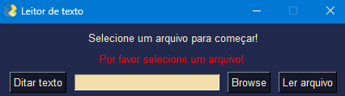

<div align="center">

</div>
<div align="center">

<p>    </p>

</div>


## -  Objective 🛠️
This project was created for help people that wanted an text to speech technologie for reading books or texts. It can also understand what you say and create a file from this.


## - Technologies 🚀️
On this project i used **docx2txt, PyPDF2, PySimpleGUI, docx, darkdetect, speech_recognition, playsound, os and gtts.**.



## - How to setup ⛳
First clone this project using:
```
git clone https://github.com/jravolio/Fake-data-generator
```
After that open you terminal on the project folder and run:
```
pip install -r requirements.txt
```
After that just execute the python file and everything shoud be functioning! :)
